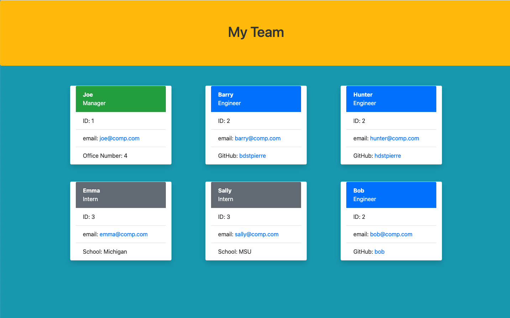

# team-profile
## Description

This project is a Node.js project that generates a team webpage based on data input at a command line interface (CLI).  This program can be used by someone who wants to generate a quickreference page for their team.  It provides information about team member's ID number, email address and github for engineers or what school interns are attending.  The project makes use of inquirer and the filesystem functions.

[Team Profile Builder walk-through video](https://drive.google.com/file/d/1uoQaJZyGZn-x8tXGpUrz9KxSMpQVZh8s/view)

## Table of Contents
- [Installation](#installation)
- [Usage](#usage)
- [Credits](#credits)
- [Questions](#questions)
- [License](#license)
- [Features](#features)
- [How to Contribute](#how-to-contribute)
- [Tests](#tests)
## Installation
To install the project on your computer, just copy all the files from the repo to your machine and then run _npm i_ to install the dependent modules.  THen youa re ready to run the code by entering _node index_.
## Usage
After teh installation procedure listed above, the user just needs to run _node inde_ on the command line.  THe user will be prompted for the manager information first, including name, ID number, email address and office number.  THen the user is presented with a menu where they can choose to add employees to the team.  The choices include adding engineers or interns.  For engineers, the user is prompted for the employees github id instead of office number.  For interns, the user is prompted for the school the intern attends instead of office number.  After each employee added the user is brought back to the same menu where they can choose another employee type of select team complete.  Once the team is complete an index.html file is written to the _dist_ directory.  That file is ready for serving through a webserver.
## Credits
The following resources were used: fs, inquirer, Jest (for uit tests), and Node.js.
## Questions
If you have any questions you can contact the author through his github user profile: https://github.com/bdstpierre
or by sending an email to barry@stpierre.com
## License
Copyright 2021 Barry St. Pierre

    Permission is hereby granted, free of charge, to any person obtaining a copy of this software and associated documentation files (the "Software"), to deal in the Software without restriction, including without limitation the rights to use, copy, modify, merge, publish, distribute, sublicense, and/or sell copies of the Software, and to permit persons to whom the Software is furnished to do so, subject to the following conditions:
    
    The above copyright notice and this permission notice shall be included in all copies or substantial portions of the Software.
    
    THE SOFTWARE IS PROVIDED "AS IS", WITHOUT WARRANTY OF ANY KIND, EXPRESS OR IMPLIED, INCLUDING BUT NOT LIMITED TO THE WARRANTIES OF MERCHANTABILITY, FITNESS FOR A PARTICULAR PURPOSE AND NONINFRINGEMENT. IN NO EVENT SHALL THE AUTHORS OR COPYRIGHT HOLDERS BE LIABLE FOR ANY CLAIM, DAMAGES OR OTHER LIABILITY, WHETHER IN AN ACTION OF CONTRACT, TORT OR OTHERWISE, ARISING FROM, OUT OF OR IN CONNECTION WITH THE SOFTWARE OR THE USE OR OTHER DEALINGS IN THE SOFTWARE.
    

## Tests
There are unit tests to test the functionality of the employee, engineer, intern and manager classes.  These tests are included in this repo.
